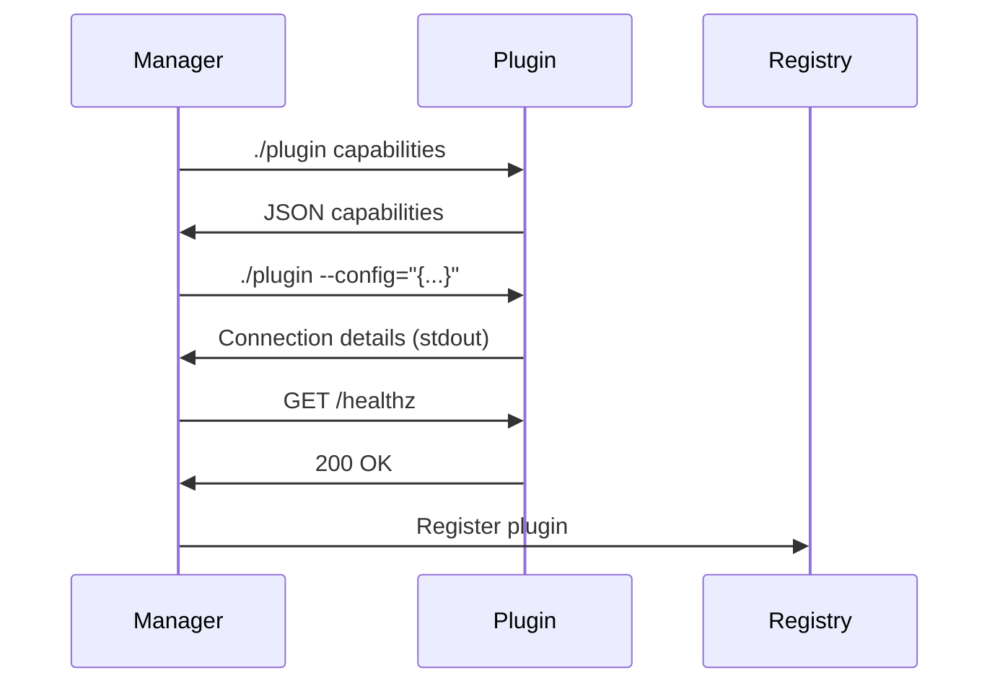
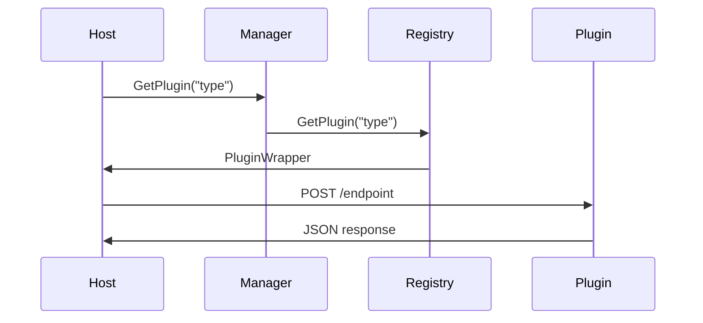

# Architecture Guide

This document provides a detailed overview of the Go Plugin Framework architecture.

## Core Components

### Plugin Manager (`manager/`)

The Plugin Manager serves as the central orchestrator for the entire plugin system. It handles plugin discovery by scanning directories for executable files, manages the complete plugin lifecycle from startup to shutdown, and passes configuration data to plugins during initialization. It also coordinates with the registry to provide unified access to all plugins.

```go
type PluginManager struct {
    Registry *registry.Registry
    baseCtx  context.Context
}
```

### Registry (`registry/`)

The Registry manages both types of plugins that the framework supports. Internal plugins are direct Go interface implementations compiled into the host application, while external plugins run as separate processes that communicate via HTTP. The registry ensures type safety by verifying that plugins implement required contracts, and provides thread-safe access for concurrent plugin lookup and management.

```go
type Registry struct {
    internalPlugins map[string]contracts.PluginBase
    externalPlugins map[string]*ExternalPlugin
}
```

### Plugin SDK (`sdk/`)

The SDK provides everything needed to build external plugins. It includes an HTTP server that handles incoming requests from the plugin manager, comprehensive lifecycle management with idle timeouts and graceful shutdown capabilities, and support for both TCP and Unix socket connections. The SDK also tracks active work to prevent plugins from shutting down while processing requests.

```go
type Plugin struct {
    Config        types.Config
    handlers      []Handler
    server        *http.Server
    workerCounter atomic.Int64
}
```

### Contracts (`contracts/`)

Contracts define type-safe interfaces that plugins must implement:

```go
type PluginBase interface {
    Ping(ctx context.Context) error
}

type DataProcessor interface {
    PluginBase
    ProcessData(ctx context.Context, input []byte) ([]byte, error)
}
```

## Communication Flow

### Plugin Registration



### Plugin Execution



## Plugin Types

### Internal Plugins

Internal plugins are compiled directly into the host application, which eliminates process overhead and allows direct memory access. This approach provides type safety at compile time and avoids network communication entirely. However, internal plugins must be compiled with the host application, crashes can affect the entire host, and they're limited to Go implementations.

### External Plugins

External plugins run as separate processes, providing process isolation and language agnosticism since any language that can serve HTTP can be used. They can be hot-swapped without recompiling the host and failures are isolated from the main application. The tradeoffs include network overhead, increased process management complexity, and serialization costs for data exchange.

## Security Model

### Process Isolation

External plugins run in separate processes, which provides memory isolation, crash isolation, and allows the operating system to enforce resource limits on individual plugins.

### Communication Security

The framework uses Unix sockets for local-only communication when possible, and when TCP is used, it binds only to the host without external network exposure. All plugin paths are sanitized to remove potentially malicious characters before use.

### Resource Management

Lock files prevent socket file conflicts by tracking process IDs, idle timeouts provide automatic cleanup of unused plugins, and the system handles SIGINT and SIGTERM signals for graceful shutdown.

## Configuration System

### Plugin Configuration

Plugins receive configuration during startup:

```json
{
  "id": "unique-plugin-instance-id",
  "type": "tcp|unix",
  "idleTimeout": "5m",
  "configTypes": [
    {
      "type": "database-config",
      "data": "{\"host\": \"localhost\", \"port\": 5432}"
    }
  ]
}
```

### Capabilities Declaration

Plugins declare their capabilities:

```json
{
  "types": {
    "dataProcessor": [
      {
        "type": "json-processor",
        "jsonSchema": "{\"type\": \"object\", ...}"
      }
    ]
  },
  "configTypes": ["database-config", "logging-config"]
}
```

## Error Handling

### Plugin Failures

The framework handles different types of plugin failures appropriately. Startup failures are logged and the plugin is skipped during registration, allowing the system to continue with other plugins. Runtime failures are isolated to the failing plugin without affecting others, and communication failures can be handled with retry logic and fallback mechanisms.

### Graceful Degradation

When plugins become unavailable, the system returns appropriate errors to callers rather than crashing. Partial failures allow the system to continue operating with available plugins, and automatic restart capabilities can be implemented for critical plugins.

## Performance Considerations

### Internal vs External

Internal plugins perform significantly faster with roughly 1-10ns per call due to direct function calls, while external plugins take around 1-10ms per call due to HTTP roundtrip overhead.

### Optimization Strategies

Several strategies can improve performance: HTTP client reuse through connection pooling, batch operations that handle multiple requests per HTTP call, caching of plugin responses when appropriate, and maintaining persistent connections with keep-alive headers.

### Memory Management

Each external plugin operates in its own memory space, providing isolation and independent garbage collection for each process. The operating system can enforce resource limits on individual plugin processes.

## Extensibility

### Adding New Plugin Types

To add new plugin types, define a contract interface in the `contracts/` directory, implement a client wrapper for external plugins, add type registration in the plugin manager, and create an example implementation to demonstrate usage.

### Custom Communication Protocols

The framework can be extended to support additional communication protocols beyond HTTP, such as gRPC communication, message queues, or entirely custom protocols depending on specific needs.

### Middleware Support

The framework can be extended with middleware for authentication, rate limiting, metrics collection, and request logging to provide additional functionality around plugin communication.

## Testing Strategy

### Unit Tests
Unit tests focus on individual component testing with mock implementations for dependencies and verification that implementations comply with their interfaces.

### Integration Tests
Integration tests cover the full plugin lifecycle, communication protocol correctness, and various error scenarios to ensure robust operation.

### Performance Tests
Performance testing includes throughput measurements, latency profiling, and resource usage monitoring to identify bottlenecks and optimize performance.