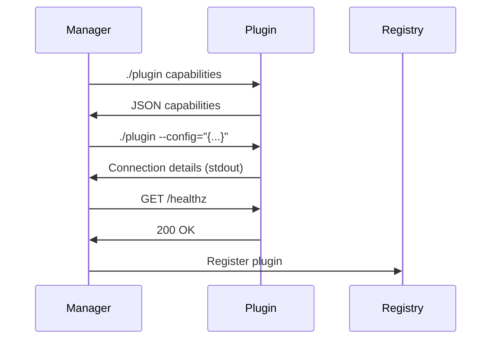
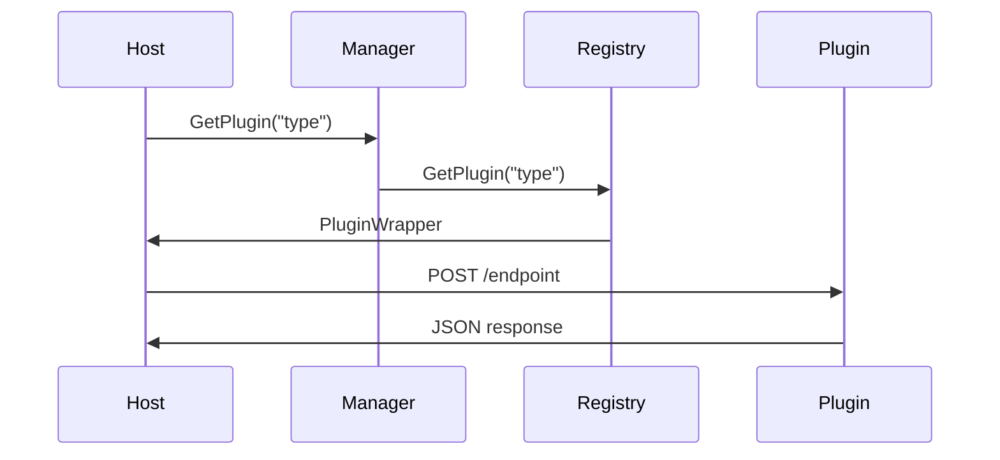

# Architecture Guide

This document provides a detailed overview of the Go Plugin Framework architecture.

## Core Components

### Plugin Manager (`manager/`)

The Plugin Manager is the central orchestrator responsible for:

- **Plugin Discovery**: Scanning directories for plugin executables
- **Lifecycle Management**: Starting, monitoring, and stopping plugins
- **Configuration**: Passing configuration data to plugins during startup
- **Registry Management**: Coordinating with the registry for plugin access

Key responsibilities:
```go
type PluginManager struct {
    Registry *registry.Registry
    baseCtx  context.Context
}
```

### Registry (`registry/`)

The Registry manages both internal and external plugin instances:

- **Internal Plugins**: Direct Go interface implementations compiled into the host
- **External Plugins**: Separate process plugins communicating via HTTP
- **Type Safety**: Ensures plugins implement required contracts
- **Concurrent Access**: Thread-safe plugin lookup and management

```go
type Registry struct {
    internalPlugins map[string]contracts.PluginBase
    externalPlugins map[string]*ExternalPlugin
}
```

### Plugin SDK (`sdk/`)

The SDK provides the framework for building external plugins:

- **HTTP Server**: Handles incoming requests from the plugin manager
- **Lifecycle Management**: Idle timeout, graceful shutdown, signal handling
- **Connection Management**: TCP and Unix socket support
- **Work Tracking**: Monitors active requests to prevent premature shutdown

```go
type Plugin struct {
    Config        types.Config
    handlers      []Handler
    server        *http.Server
    workerCounter atomic.Int64
}
```

### Contracts (`contracts/`)

Contracts define type-safe interfaces that plugins must implement:

```go
type PluginBase interface {
    Ping(ctx context.Context) error
}

type DataProcessor interface {
    PluginBase
    ProcessData(ctx context.Context, input []byte) ([]byte, error)
}
```

## Communication Flow

### Plugin Registration



### Plugin Execution



## Plugin Types

### Internal Plugins

Internal plugins are compiled directly into the host application:

**Advantages:**
- No process overhead
- Direct memory access
- Type safety at compile time
- No network communication

**Disadvantages:**
- Must be compiled with host
- Crashes can affect host
- Limited to Go implementations

### External Plugins

External plugins run as separate processes:

**Advantages:**
- Process isolation
- Language agnostic (any language that can serve HTTP)
- Hot-swappable without recompiling host
- Failure isolation

**Disadvantages:**
- Network overhead
- Process management complexity
- Serialization costs

## Security Model

### Process Isolation

External plugins run in separate processes, providing:
- Memory isolation
- Crash isolation
- Resource limiting (via OS mechanisms)

### Communication Security

- **Local Communication**: Unix sockets for local-only communication
- **TCP Security**: Host-only binding, no external network exposure
- **Path Sanitization**: Removes potentially malicious characters from plugin paths

### Resource Management

- **Lock Files**: Prevent socket file conflicts using PID tracking
- **Idle Timeouts**: Automatic cleanup of unused plugins
- **Signal Handling**: Graceful shutdown on SIGINT/SIGTERM

## Configuration System

### Plugin Configuration

Plugins receive configuration during startup:

```json
{
  "id": "unique-plugin-instance-id",
  "type": "tcp|unix",
  "idleTimeout": "5m",
  "configTypes": [
    {
      "type": "database-config",
      "data": "{\"host\": \"localhost\", \"port\": 5432}"
    }
  ]
}
```

### Capabilities Declaration

Plugins declare their capabilities:

```json
{
  "types": {
    "dataProcessor": [
      {
        "type": "json-processor",
        "jsonSchema": "{\"type\": \"object\", ...}"
      }
    ]
  },
  "configTypes": ["database-config", "logging-config"]
}
```

## Error Handling

### Plugin Failures

- **Startup Failures**: Logged and skipped during registration
- **Runtime Failures**: Isolated to the failing plugin
- **Communication Failures**: Retries and fallback mechanisms

### Graceful Degradation

- **Plugin Unavailable**: Return appropriate error to caller
- **Partial Failures**: Continue with available plugins
- **Recovery**: Automatic restart capabilities (if implemented)

## Performance Considerations

### Internal vs External

- **Internal**: ~1-10ns per call (direct function call)
- **External**: ~1-10ms per call (HTTP roundtrip)

### Optimization Strategies

- **Connection Pooling**: HTTP client reuse
- **Batch Operations**: Multiple operations per request
- **Caching**: Cache plugin responses when appropriate
- **Keep-Alive**: Maintain persistent connections

### Memory Management

- **Plugin Isolation**: Each external plugin has its own memory space
- **Garbage Collection**: Independent GC for each process
- **Resource Limits**: OS-level resource limiting

## Extensibility

### Adding New Plugin Types

1. Define contract interface in `contracts/`
2. Implement client wrapper for external plugins
3. Add type registration in plugin manager
4. Create example implementation

### Custom Communication Protocols

The framework can be extended to support:
- gRPC communication
- Message queues
- Custom protocols

### Middleware Support

Add middleware for:
- Authentication
- Rate limiting
- Metrics collection
- Request logging

## Testing Strategy

### Unit Tests
- Individual component testing
- Mock implementations for dependencies
- Interface compliance testing

### Integration Tests
- Full plugin lifecycle testing
- Communication protocol testing
- Error scenario testing

### Performance Tests
- Throughput measurements
- Latency profiling
- Resource usage monitoring